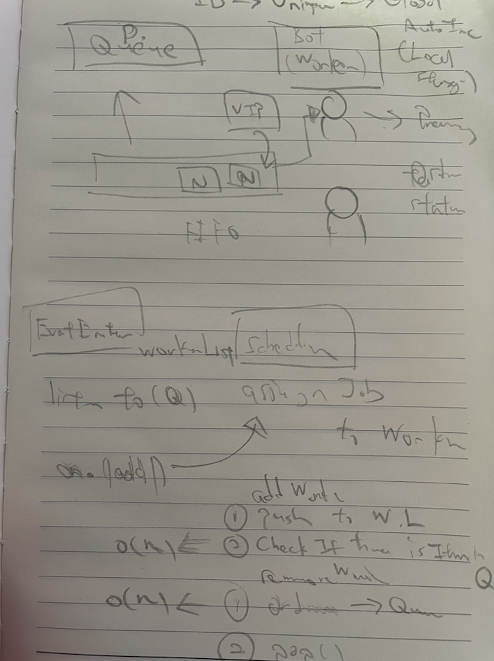

# Assignment Overview

## Initial Thoughts

When I first read the requirements, the first things that came to mind were as follows:

1. I need a priority queue to store all the orders.
2. I need a worker to pick up and process the orders.
3. I need a scheduler to manage the orders and workers.
4. I need an event emitter to notify the UI when the orders or workers are updated.

Therefore, the core logic of the application would revolve around the components mentioned above for implementation.



## Project Structure

```
se-take-home-assignment/
├── src/
│   ├── components/
│   │   ├── ActionMenu.vue    # Menu for managing orders and bots
│   │   ├── CardQueue.vue     # Component for displaying queues of cards
│   │   └── ui/               # Shadcn UI components
│   ├── lib/                  # Helper utilities
│   ├── core/
│   │   ├── __tests__/        # Unit Tests
│   │   ├── cooking-bot.ts    # Bot implementation for cooking orders
│   │   ├── order.ts          # Order class definition
│   │   └── queue.ts          # Priority queue implementation
│   ├── stores/
│   │   └── order-store.ts    # Central store for orders and bots
│   ├── typings/
│   │   └── enums.ts          # Enums for order status, bot status, etc.
│   ├── App.vue
│   └── main.ts
├── public/                   # Public static assets
├── tests/                    # E2E and integration tests
│   ├── cooking-bot.test.ts   # Tests for CookingBot class
│   └── queue.test.ts         # Tests for PriorityQueue
├── index.html                # HTML entry point
├── jest.config.ts            # Jest configuration
├── tailwind.config.js        # Tailwind CSS configuration
├── tsconfig.json             # TypeScript configuration
└── vite.config.ts            # Vite configuration
```

## Architecture Overview

1. Core Logic (core/)

- Contains the essential business logic
- Pure TypeScript with no UI dependencies
- Designed to be framework-agnostic

2. State Management (stores/)

- Uses Pinia for reactive state management
- Bridges the core logic with the UI components

3. Presentation (components/)

- Vue components for rendering UI elements
- Includes Shadcn UI components for consistent styling

## Data Flow

The application follows a unidirectional data flow:

1. User actions trigger store methods
2. Store methods update the state
3. UI components reactively render based on store state

## Key Components

### Core Logic

- PriorityQueue: Handles order prioritization (VIP vs normal)
- CookingBot: Processes orders with timeout simulation
- OrderStore: Manages the application state and coordinates bots and orders

### State Management

- OrderStore: Central store for managing orders and bots

### UI

- CardQueue: Displays orders and bots in the UI
- ActionMenu: Provides controls for adding orders and bots

## Technologies Used

- Vue 3 for the UI
- TypeScript for type safety
- Pinia for state management
- Tailwind CSS and Shadcn for styling
- Jest for unit testing

## Some Considerations

1. The current implementation of the `PriorityQueue` is not optimized for performance. It uses a simple array to store the orders and sorts them on every insertion (O(n log n)). A more efficient implementation would use a heap data structure to maintain the order of the elements.
2. The `CookingBot` class uses a simple `setTimeout` to simulate the cooking process. In a real-world scenario, this would be replaced with actual cronjob, pub/sub messaging, or event-driven architecture. Initially, I thought of extending the `EventTarget` to handle the events, but I decided to keep it simple for this assignment.

## Testing

The tests focus on the core business logic rather than UI components, as these core classes contain the most critical functionality. Future test improvements could include more comprehensive integration tests and E2E tests.

Run the Tests:

```bash
npm test
```

Or, running the Application

```bash
npm run dev
```

## Deployment

The application is deployed to GitHub Pages and can be accessed at the following URL:
[https://tcchong.github.io/se-take-home-assignment/](https://tcchong.github.io/se-take-home-assignment/)
